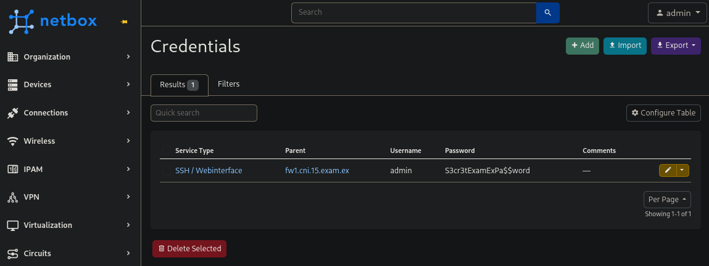
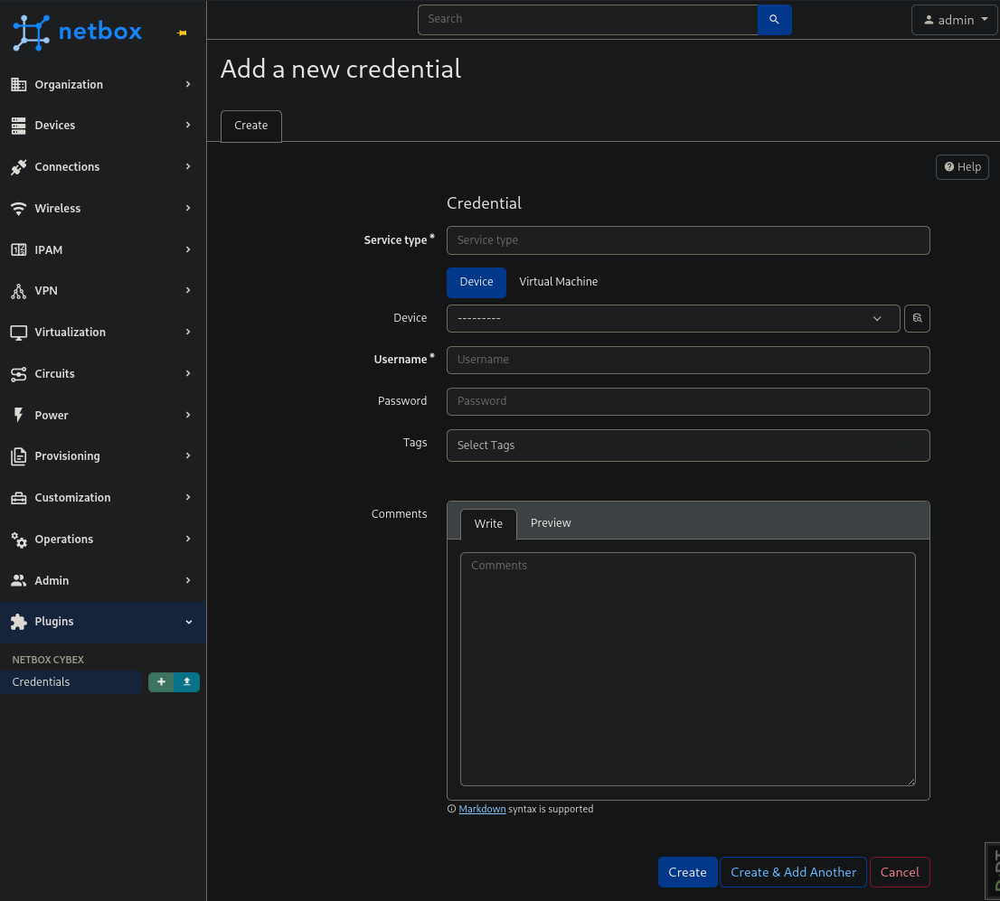
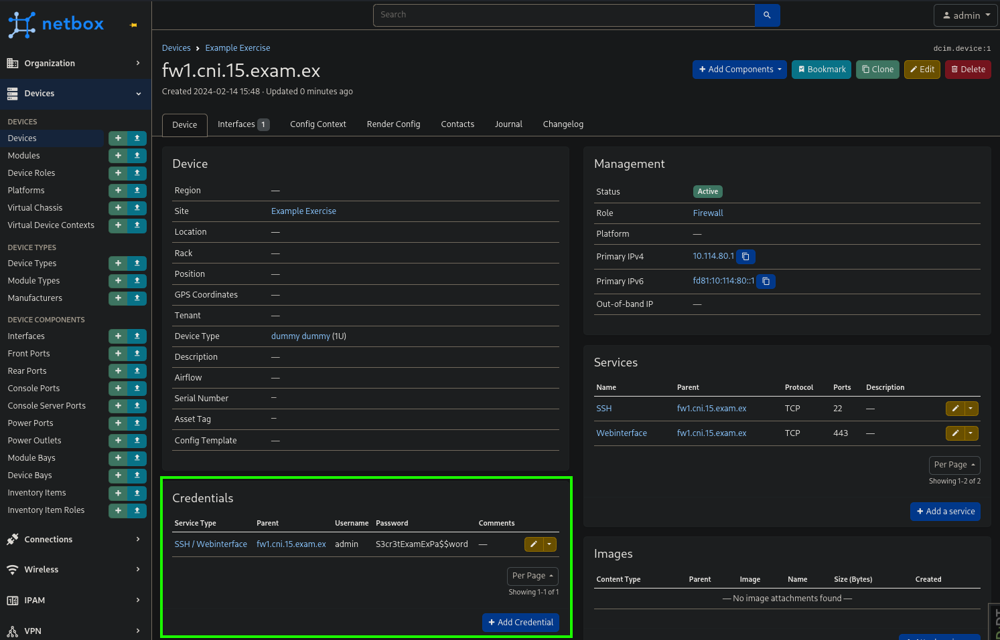

# Netbox Plugin: CybEx

This plugin adds features for cyber exercises to your 
[NetBox](https://github.com/netbox-community/netbox) instance. It should be 
used exclusively for IT security trainings and cyber exercises where 
applications such as Netbox are out of scope. Do **not** use parts of this 
plugin (e.g., the credentials section) in a non-training environment!

## Preview






## Deployment
### Docker
### NixOS
A default netbox deployment for NixOS can be found on 
[github:secshellnet/nixos](https://github.com/secshellnet/nixos/blob/main/modules/netbox.nix), 
you can add plugins like this:
```
{ lib
, ...
}: let
  netbox_cybex = ps: ps.buildPythonPackage rec {
    pname = "netbox_cybex";
    version = "0.1";
    format = "pyproject";

    src = ps.fetchPypi {
      inherit pname version;
      hash = "sha256-YfC5aOHQQqjTCv2mac+p/1zX/8M+TemYyoim9YSXJPs=";
    };

    nativeBuildInputs = with ps; [
      setuptools
    ];

    meta = with lib; {
      description = "Features for cyber exercises in NetBox";
      homepage = "https://github.com/felbinger/netbox_cybex";
      license = licenses.mpl20;
      platforms = platforms.linux;
    };
  };
in {

  # Your NetBox configuration
  # ...

  services.netbox.plugins = (ps: [ (netbox_cybex ps) ]);
  services.netbox.settings.PLUGINS = [ "netbox_cybex" ];
}
```

## Development Environment
```sh
git clone --branch v3.7.2 --single-branch https://github.com/netbox-community/netbox ~/netbox
python3 -m venv ~/netbox/venv
source ~/netbox/venv/bin/activate
pip3 install -r ~/netbox/requirements.txt

# create configuration from example
cat ~/netbox/netbox/netbox/configuration_example.py | \
  sed -e "s/^DEBUG.*/DEBUG = True/" | \
  sed -e "s/^SECRET_KEY.*/SECRET_KEY = '$(~/netbox/netbox/generate_secret_key.py)'/" | \
  sed -e "s/^ALLOWED_HOSTS.*/ALLOWED_HOSTS = \[\'127.0.0.1\'\]/" | \
  sed -e "s/'USER': ''/'USER': 'postgres'/" > ~/netbox/netbox/netbox/configuration.py

# start database and redis
docker compose up -d

~/netbox/netbox/manage.py migrate
~/netbox/netbox/manage.py createsuperuser \
  --username admin \
  --email admin@localhost.localdomain
~/netbox/netbox/manage.py runserver

# netbox should now reachable on: http://127.0.0.1:8000/

# build plugin
python3 setup.py develop

# add plugin to configuration
sed -i -e "s/^PLUGINS.*/PLUGINS = \['netbox_cybex'\]/" ~/netbox/netbox/netbox/configuration.py

# enable developer mode to enable usage of makemigrations
echo "DEVELOPER=True" >> ~/netbox/netbox/netbox/configuration.py

# Building the app
~/netbox/netbox/manage.py makemigrations
~/netbox/netbox/manage.py migrate

# Publish
python3 -m pip install --upgrade build twine
python3 -m build
python3 -m twine upload --repository pypi dist/*
```

## TODO
- Think about other useful extensions
  - Firewall
    - generate rules for iptables/vyatta/firewalld (maybe even commands to add them to pfsense if somehow possible)
    - need to be easily manageable using importable data, otherwise gui needs to be used, which sucks... (same with pfSense)
- Test API (Make sure it's working as expected)
- Create ansible module `cybex.netbox.netbox_credential` to add creds to existing virtual machine
- Package for nix

